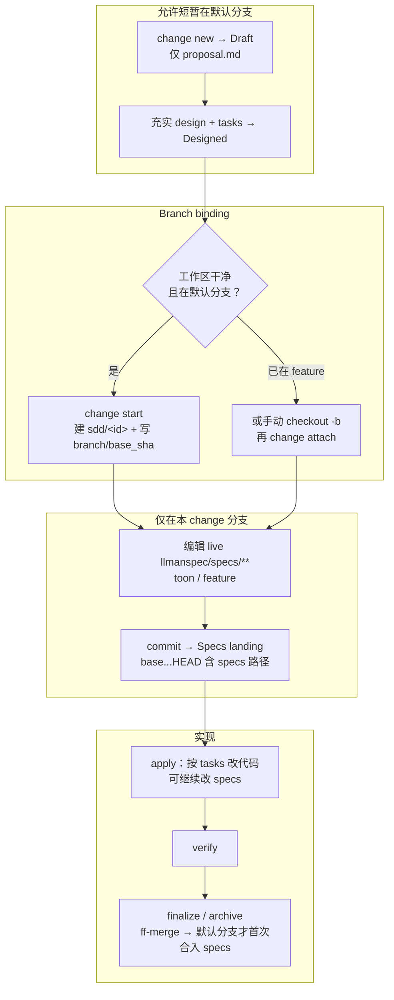

# LLMAN SDD Continue

使用此 skill 继续已有变更，创建下一个缺失的 artifact。

## 步骤
1. 确定 change id：
   - 若用户已提供，直接使用。
   - 否则运行 `llman sdd list --json` 并询问要继续哪个 change。
   - 始终说明："使用变更：<id>"。
2. 阅读变更目录：`llmanspec/changes/<id>/`。
## 阶段守卫（`stage` / `readyToImplement`）

用权威 JSON 判定（勿凭「完整工件」口头说法）：

```bash
llman sdd show <id> --json --type change
```

解读字段：`stage`、`specsLanded`、`skipSpecsLanding`、`readyToImplement`。

| 条件 | 动作 |
|------|------|
| `stage=draft`（仅 proposal.md） | STOP。长大到 Designed（proposal + tasks；design 按需）→ Branch binding → Specs landing。draft 不能直接 apply/verify。若已有 proposal+design+tasks 仍是 `draft`：未 start/attach —— 在默认分支干净树跑 `change start`，或手动建分支后 `change attach`。**不要**建 `changes/<id>/specs/`，**不要**先在默认分支改 live specs。 |
| `stage=designed` | STOP。先 `change start` / `attach`（Branch binding）。 |
| `stage=full` 且 `readyToImplement=false` | STOP。在**绑定分支**完成 Specs landing（编辑 `llmanspec/specs/**` 并 commit），或设 `skip_specs_landing`。**不要**再跑 `change start`。丢失绑定分支 specs → checkout/重建 + 必要时 `attach --force`。 |
| `readyToImplement=true` | 可通过 apply/verify 前置检查。`changes/<id>/specs/` 预期**不存在**，勿当缺失。 |
3. 确定下一个要创建的 artifact（按顺序）：
   1) `proposal.md`
   2) `design.md`（仅当涉及设计权衡时）
   3) `tasks.md`
   4) `llman sdd change start <id>`（或分支已存在时用 `change attach <id>`）——Branch binding
   5) 在**绑定分支**上编辑 live `llmanspec/specs/<capability>/<capability>.feature` 并 commit——Specs landing（无合约变更可设 `skip_specs_landing: true`）
4. 只创建**一个**缺失 artifact（或在绑定分支上做一次 live spec/feature 编辑）。
   - continue 模式**不要**实现应用代码。
   - **不要**创建 `*.feature.delta.toon` 或 `changes/<id>/specs/` 下的文件。
   - **不要**在未 start/attach 前改公共 `llmanspec/specs/**`。
5. 若所有 artifact 已齐全，按 `llman sdd show <id> --json` 建议下一步：
   - `readyToImplement=false` → 先完成 Specs landing（或 `skip_specs_landing`）；**不要**建议 apply
   - `readyToImplement=true` → 实施：`llman-sdd-apply`
   - verify 之后 → 归档：`llman-sdd-archive`
   - 校验：`llman sdd validate <id> --strict --no-interactive`
   - 审查：`llman sdd change diff <id>`（只读）

## Git-native 生命周期（权威全图）

勿混淆两层：**Git-native 生命周期**（Branch binding → Specs landing → `readyToImplement`）与 **Skill 导航**（explore→propose→apply→verify→archive）。Specs landing **不是**独立 skill。



硬规则：
1. **先** `change start` / `attach`（Branch binding / 分支绑定）进入 Full；**再**在绑定的非默认分支编辑 `llmanspec/specs/**` 并 commit（Specs landing / 合约落地）。
2. 无 live 合约变更时可设 frontmatter `skip_specs_landing: true`。进入 apply 前 `llman sdd show <id> --json` 的 `readyToImplement` 须为 true（`Full ∧ (specsLanded ∨ skip)`）。
3. **禁止**为过干净树门禁把 live specs commit 到默认分支；已 attach 时不要重复 `start`。
行动前先阅读 `llmanspec/config.yaml`，并遵循其中的 `context` 与 `rules`（若有）。

常用命令：
- `llman sdd context --task "<描述>" --paths "<文件>"`（找相关 specs）。使用 pageindex agentic tree 后端（需 `LLMAN_SDD_INDEX_CHAT_MODEL`）。可用 `LLMAN_SDD_INDEX_BACKEND` 预设。
- `llman sdd list`（列出变更）
- `llman sdd list --specs`（列出 specs 及 purpose/scope 元数据）
- `llman sdd show <id>`（展示 change/spec；`--type change --output json` 含 `stage` / `specsLanded` / `skipSpecsLanding` / `readyToImplement`——apply 门禁看 `readyToImplement`，勿凭「完整工件」）
- `llman sdd validate <id>`（校验 change 或 spec）
- `llman sdd validate --all`（批量校验）
- `llman sdd index rebuild`（重建 pageindex 树索引——不需要模型）
- `llman sdd index check`（检查索引新鲜度）
- `llman sdd change new <id>`（仅创建规划壳草稿 `changes/<id>/proposal.md`；不写 live specs）
- `llman sdd change start <id> [--worktree]`（Designed→Full：干净树且在默认分支 → 创建 `sdd/<id>` 分支 + attach；仅 Branch binding，不等于 Specs landing，不等于可 apply）
- `llman sdd change attach <id> [--force]`（绑定已有非默认 feature 分支 + base SHA；拒绝绑到默认分支）
- `llman sdd change finalize <id> [--no-check]`（**推荐单 commit 收尾**——verify 之后；不要求干净树；门禁 + 自动 ff-merge + 文档改名）
- `llman sdd change checkpoint <id> [--no-check]`（干净工作区 + 归档前门禁；严格 sha = HEAD；finalize 的 fallback）
- `llman sdd change diff <id> [--export-patch <path>]`（只读 `base...HEAD` 审查/导出）
- `llman sdd change archive <id>`（封存：自动 ff-merge 到默认分支，再改名到 `changes/archive/`；单 commit 收尾优先 `finalize`）
- `llman sdd archive freeze [--before YYYY-MM-DD] [--keep-recent N] [--dry-run]`（冻结已归档目录）
- `llman sdd archive thaw [--change <id> ...] [--dest <path>]`（从冷备份恢复）
- `llman sdd graph [CHANGE] [--format mermaid] [--scope active|archived|all] [--depth N]`（生成变更依赖图）
- `llman sdd project migrate --kind spec-md2toon`（`.md`+fence → 独立 `.toon`；`partitioned` 已移除）
校验修复（单轨 feature-as-spec）：

1）缺少头注释（`missing # capability: header comment`）：
每个 `llmanspec/specs/<capability>/<capability>.feature` 必须以以下注释开头：
```
# language: zh-CN
# capability: <capability>
# purpose: 一句话概述
# scope: src/
```

2）tag 语法（`@human constraint scenario must carry an @req:<req_id> tag` / `orphan acceptance scenario`）：
- 规则：`@req:<id> @human` —— statement 放场景描述（须含 MUST/SHALL）。
- 验收：`@executable` 且至少一个 `@req:<id>` 挂到规则。
- `@manual` 须与 `@human` 同用；禁止 `@human` 与 `@executable` 同场景。

3）遗留 `spec.toon`（`legacy spec.toon found ... run ... toon2features`）：
运行 `llman sdd project migrate --kind toon2features --yes`，审阅 diff 后提交。

Git-native 护栏：
- **Branch binding** → **Specs landing**：先 `change start` / `attach`，再在绑定的非默认分支编辑 live `.feature` 并 commit。
- 锁定规则：修改/删除既有 `@human` 场景会触发门禁，除非 proposal frontmatter 带 `rules_edit_acked: true`。
- apply 前须 `readyToImplement=true`（或 `skip_specs_landing`）。收尾优先 `change finalize`。
- 勿使用 `change delta` / solidify / `*.feature.delta.toon`。

## Context
- 执行前先确认当前 change/spec 状态。
- 优先使用 `llman sdd context --task --paths` 获取相关 specs，而非全量读取或猜测。

## Goal
- 明确本次命令/skill 要达成的可验证结果。

## Constraints
- 变更保持最小化且范围明确。
- 标识符或意图不明确时禁止猜测。
- 在读取 spec 全文前，先使用 `llman sdd context --task --paths` 获取相关 specs。
- 判断变更规模后选择路径：行为合约变更走完整 SDD（Branch binding → Specs landing → `readyToImplement` → apply）；实现变更走快速路径（live specs 仍须绑定分支）。
- 勿混淆 Skill 导航与 Git-native 生命周期；勿在默认分支编辑 live `llmanspec/specs/**`。

## Workflow
- 以 `llman sdd` 命令结果为事实来源。
- 涉及文件/规范变更时执行校验。
- 首选 `llman sdd context` 获取相关 specs，而非全量读取或猜测。
- 当 context 不可用时，按错误提示处理（重建 index 或降级到 `list --specs --json`）。

## Decision Policy
- 高影响歧义必须先澄清。
- 已知校验错误下禁止强行继续。

## Output Contract
- 汇总已执行动作。
- 给出结果路径与校验状态。

## Ethics Governance
- `ethics.risk_level`：按 `low|medium|high|critical` 标注风险等级。
- `ethics.prohibited_actions`：列出绝对禁止执行的动作。
- `ethics.required_evidence`：列出高影响输出前必须具备的证据。
- `ethics.refusal_contract`：定义何时拒答以及安全替代响应方式。
- `ethics.escalation_policy`：定义何时必须升级为用户确认/人工复核。
