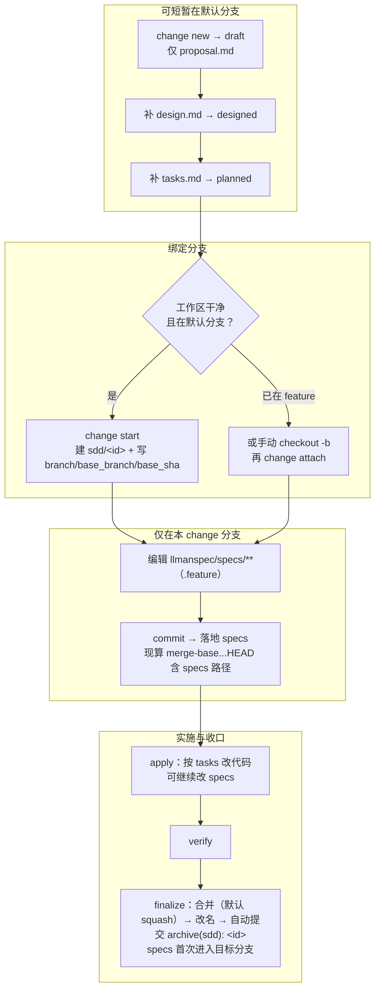

# LLMAN SDD Continue

继续已有 change，创建下一个缺失工件。

## 步骤
1. 确定 change id：用户给了就用；否则跑 `llman-sdd list --json` 让用户选。始终说明「使用变更：<id>」。
2. 读 `llmanspec/changes/<id>/`。
> 阶段判定：用 `llman-sdd show <id> --output json --type change` 的 `stage` / `readyToImplement`；完整判定表见 llman-sdd-apply。
3. 按顺序确定下一个缺失工件：
   1) `proposal.md`
   2) `design.md`（仅有设计权衡时）
   3) `tasks.md`
   4) `llman-sdd change start <id>`（分支已存在用 `change attach <id>`）——绑定分支
   5) 在**绑定分支**编辑 `llmanspec/specs/<capability>.feature`（扁平，或目录主文件）并 commit——落地 specs（无合约变更设 `needs_specs_change: false`）
4. 只创建**一个**缺失工件（或一次绑定分支上的 spec 编辑）。
   - 不写应用代码；**不要**建 `changes/<id>/specs/`；**不要**在 start/attach 前改 `llmanspec/specs/**`。
5. 工件已齐全时，按 `llman-sdd show <id> --output json` 建议下一步：
   - specs-landed 门未过 → 先落地 specs（或 `needs_specs_change: false`）；**不要**建议 apply
   - specs-landed 门已绿（即使实施中期 `readyToImplement=false`、tasks 未完）→ `llman-sdd-apply`
   - verify 之后 → `llman-sdd-archive`
   - 校验：`llman-sdd validate <id> --strict`；审查：`llman-sdd change diff <id>`（只读）

## Git 分支生命周期（权威全图）

两层别混：**分支生命周期**（绑定分支 → 落地 specs → `readyToImplement`）与 **skill 导航**（explore→propose→apply→verify→archive）。落地 specs **不是**独立 skill。


```mermaid
flowchart TB
  subgraph main_ok["可短暂在默认分支"]
    A["change new → draft<br/>仅 proposal.md"]
    B1["补 design.md → designed"]
    B2["补 tasks.md → planned"]
  end

  subgraph bind["绑定分支"]
    C{"工作区干净<br/>且在默认分支？"}
    D["change start<br/>建 sdd/&lt;id&gt; + 写 branch/base_branch/base_sha"]
    E["或手动 checkout -b<br/>再 change attach"]
  end

  subgraph specs_only["仅在本 change 分支"]
    F["编辑 llmanspec/specs/**（.feature）"]
    G["commit → 落地 specs<br/>现算 merge-base...HEAD 含 specs 路径"]
  end

  subgraph implement["实施与收口"]
    H["apply：按 tasks 改代码<br/>可继续改 specs"]
    I["verify"]
    J["finalize：合并（默认 squash）→ 改名 → 自动提交 archive(sdd): &lt;id&gt;<br/>specs 首次进入目标分支"]
  end

  A --> B1 --> B2 --> C
  C -->|是| D --> F
  C -->|已在 feature| E --> F
  F --> G --> H --> I --> J
```

硬规则：
1. **先** `change start` / `attach` 绑定分支（进入 full）；**再**在绑定的非默认分支编辑 `llmanspec/specs/**` 并 commit（落地 specs）。
2. 无合约编辑的 change 设 frontmatter `needs_specs_change: false`。`stage=full` 且 specs-landed 门通过（specsLanded ∨ needs_specs_change=false）即可进 apply；`readyToImplement=true`（gateChecks 全过，含 tasks-done）是 verify/finalize 前的完成信号。diff 范围一律现算 merge-base；存储的 `base_sha` 仅审计。
3. 收口一律 `llman-sdd change finalize <id>`：自动提交 `archive(sdd): <id>`（实现 diff + 改名一笔）；`--no-commit` 跳过自动提交。change 分支上提交自由（分段或 finalize 一次收尾均可）。
4. **禁止**为过干净树门禁把 specs commit 到默认分支；已 attach 勿重复 `start`。

Worktree 决策表：

| 工作形态 | 命令 | 判据 |
|---|---|---|
| 单检出 | `llman-sdd change start <id>` | 在默认分支且树干净；直接切到新分支 |
| 保留当前检出 / 并行 change | `llman-sdd change start <id> --worktree` | 分支建于独立 worktree（`sdd.worktree_root` / `sdd.worktree_naming` 可调，缺省仓库根兄弟目录），当前检出不动，输出含 worktree 路径；配 `--base <branch>` 记录非默认分叉源 |
| 已在 feature 分支（含手工 wt/git-worktree） | `llman-sdd change attach <id>` | 分支已存在；`--base <branch>` 显式记录分叉源 |

finalize 目标定位：目标分支被其他 worktree 持有时，`llman-sdd change finalize <id>` / `llman-sdd change archive <id>` 自动在该 worktree 内完成合并、改名与提交（输出含 `executed in target worktree <path>`）；持有 worktree 脏时中止报错并列出处置选项（零写入）。
> 命令细节用 `llman-sdd <cmd> --help` 查看；命令参考以 CLI 为准，skill 不内嵌命令表。
> 文中「规约」= 本项目 `llmanspec/specs/` 下的 `.feature` 文件；用 `llman-sdd list --specs` / `llman-sdd show <capability>` 查全文。
校验修复（单轨 feature-as-spec）：

1）缺头注释（`missing # capability: header comment`）：每个 capability `.feature`（`llmanspec/specs/<capability>.feature` 或目录内同名主文件）必须以下列注释开头：
```
# language: zh-CN
# capability: <capability>
# purpose: 一句话概述
# scope: src/
```

2）原生分层格式（`rule must carry an @req:<req_id> tag on the rule header`）：
- 规范样式只有一种：`@req:<id>` 挂在 `规则:` 块头标签,块内嵌套 `场景:`(假如/当/那么)是可执行示例——默认首选。
- 仅当需求无法程序化表达或暂不转写时才保留无嵌套场景的 `规则:`(裸规则):描述自由文本,无 MUST/SHALL 强制;validate 以聚合计数提示,review `pending` 信号计量,specs-compact 负责压降。
- 历史标签 `@executable`/`@rule`/`@human`/`@manual` 不再使用、解析惰性;旧文件报结构问题时运行 `llman-sdd spec migrate-native` 迁移。
- 不在任何 `规则:` 内的顶层 `场景:` 是功能级示例:无规则句柄、不告警、不参与规则统计(Gherkin 原生语义)。

分支护栏：
- 先 `change start` / `attach` 绑定分支，再在绑定的非默认分支编辑 `.feature` 并 commit（落地 specs）。
- 锁定规则（报告制）：改/删既有 `规则:` 块只出 WARNING，不阻断 validate / finalize / `change diff`；报告按 `@req:<id>` 指明被改规则。控制点：git 分支对比 + `llman-sdd review` / `change diff`。旧锁定确认元数据（frontmatter `rules_touched` / `agent_acked`、`@agent` tag、`--yes` 确认语义）已全部删除，无别名无兼容层。
- `stage=full` 且 specs-landed 门通过（specsLanded ∨ `needs_specs_change: false`）即可进 apply；verify/finalize 须 `readyToImplement=true`（完成信号）。收口优先 `change finalize`。

## Context
- 先查状态再动手：change/spec 状态以 `llman-sdd show/list/validate` 输出为准；读 spec 全文前先用 `llman-sdd context --task --paths` 定位。

## Goal
- 达成一个可验证结果；报告附结果路径与校验状态。

## Constraints
- 遵守正文硬约束（不复读）。先判断规模选路径：合约变更走完整 SDD，实现层走 quick；不确定选完整 SDD。改动最小；已知校验错误禁止强行继续。

## Workflow
- 每步以 `llman-sdd` 命令结果为事实来源；改动工件后必跑 `llman-sdd validate`；命令细节见 `llman-sdd <cmd> --help`。

## Decision Policy
- 高影响歧义先澄清再继续；事实自己查证，只有决策问用户。

## Output Contract
- 先给人读摘要（结论 / 风险 / 待决策），机器细节随后。

## Ethics Governance
- `ethics.risk_level`：low——仅读写本仓库与 `llmanspec/`，无外发动作；正文另有声明时从其声明。
- `ethics.prohibited_actions`：违反正文「硬约束」的动作；未经用户明确要求的 push / PR / 外部上传。
- `ethics.required_evidence`：结论须有命令输出或文件路径佐证；门禁状态以 `llman-sdd validate` 为准。
- `ethics.refusal_contract`：门禁 CRITICAL 未清零 → 拒绝进入下一阶段；自修复达上限 → 报告 blocker。
- `ethics.escalation_policy`：改动 SDD 合约/模板或执行不可逆动作前，暂停并请用户确认。
