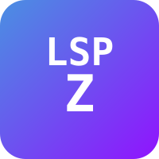

<div align="center">
  

  # lspz

  [](https://crates.io/crates/lspz)
  [](https://docs.rs/lspz)
  [](https://github.com/straydragon/lspz/blob/main/LICENSE)
  [](https://blog.rust-lang.org/2025/02/20/Rust-2024-Edition.html)
  [](https://github.com/straydragon/lspz/actions)

  **lsp** **z**ip — compress LSP messages so AI agents burn fewer tokens

  [Getting Started](docs/src/getting-started.md) · [Architecture](docs/src/architecture.md) · [API Docs](https://docs.rs/lspz) · [Book](docs/src/SUMMARY.md)
</div>

---

lspz sits between an AI coding agent and the LSP server. It intercepts server responses (diagnostics, completions, symbols, hover, etc.) and rewrites them into compact formats that use significantly fewer tokens — useful when the agent pays per token or has a fixed context window.

## How it works

```
Agent (LSP client) ←→ lspz ←→ LSP server (rust-analyzer, gopls, ...)
```

All client-to-server traffic passes through unchanged. Server-to-client responses run through a chain of interceptors that strip redundant fields, deduplicate, and encode into compact formats. If any interceptor fails, the original message is forwarded as-is — the proxy never breaks your LSP session.

## Three ways to use it

**Library** — embed in your Rust agent:

```toml
[dependencies]
lspz = { version = "0.9", default-features = false }
```

**CLI proxy** — drop-in replacement for your LSP server command:

```bash
lspz proxy --backend rust-analyzer
```

**MCP server** — expose LSP as MCP tools for Claude Desktop and similar clients:

```bash
lspz mcp
```

## Compression results

Measured with tiktoken on realistic LSP server output. TOON (Token-Oriented Object Notation) is the default output format.

| Interceptor | LSP method | Compact savings | TOON savings |
|---|---|---|---|
| DiagnosticsCompressor | `textDocument/publishDiagnostics` | 73.5% | 76.6% |
| HoverCompressor | `textDocument/hover` | 1.6% | 23.8% |
| DocumentSymbolCompressor | `textDocument/documentSymbol` | 33.0% | 72.1% |
| CompletionCompressor | `textDocument/completion` | — | 16.9% |
| LocationCompressor | references/definition/... | 60–85% | — |
| WorkspaceDiagnosticCompressor | `workspace/diagnostic` | 83–90% | — |
| WorkspaceSymbolCompressor | `workspace/symbol` | 70–76% | — |
| CappingInterceptor | any large response | 80–95% | — |

Full benchmark data in [benchmarks.md](docs/src/benchmarks.md).

## Output formats

| Format | Description | Use case |
|---|---|---|
| `toon` (default) | Self-describing line protocol + tables | LLM consumption |
| `compact` | Shortened JSON field names | When you need structured data |
| `passthrough` | Original LSP JSON untouched | Debugging |

## Feature flags

| Flag | What it enables | Default |
|---|---|---|
| `cli` | `lspz` binary (clap, tracing-subscriber) | on |
| `mcp` | MCP server via rmcp | off |
| `agent-sdk` | AgentHandle + AgentPool (implies `mcp`) | off |
| `transport-tcp` | TcpTransport | off (code always included) |
| `transport-websocket` | WsTransport | off |

## Agent SDK

For embedding LSP capabilities in your own agent. Supports 10 query methods, file sync, and refactoring operations:

```rust
use lspz::agent_sdk::AgentHandle;

let mut agent = AgentHandle::builder()
    .backend("rust-analyzer")
    .language("rust")
    .workspace_root("/home/user/project")
    .start()
    .await?;

let diags = agent.get_diagnostics("file:///home/user/project/src/main.rs").await?;
let completions = agent.get_completions("file:///home/user/project/src/main.rs", 42, 10).await?;
let edits = agent.rename("file:///home/user/project/src/main.rs", 10, 5, "new_name").await?;

agent.shutdown().await?;
```

See [Agent Integration Guide](docs/src/guides/agent-integration.md) for the full API.

## Quick verification

```bash
cargo run --example compress-demo   # show token savings for all interceptors
cargo bench                         # Criterion throughput benchmarks
just qa                             # fmt + clippy + test + doc-check
```

## Documentation

- [Book](docs/src/SUMMARY.md) — architecture, guides, and specs
- [API reference](https://docs.rs/lspz) — auto-generated from `///` comments
- [CHANGELOG](CHANGELOG.md) — version history
- [ROADMAP](ROADMAP.md) — what's done and what's planned

## License

MIT
