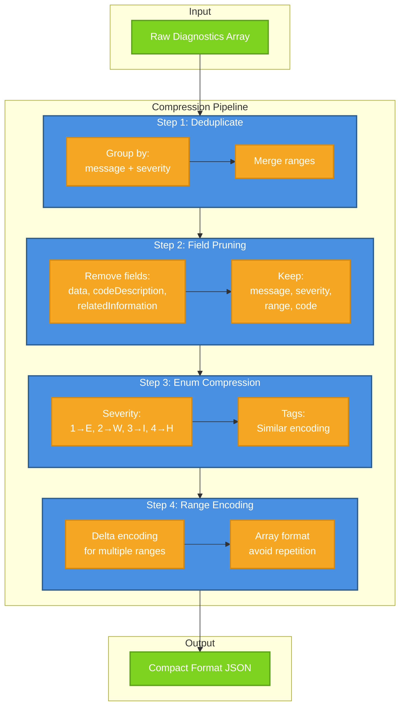
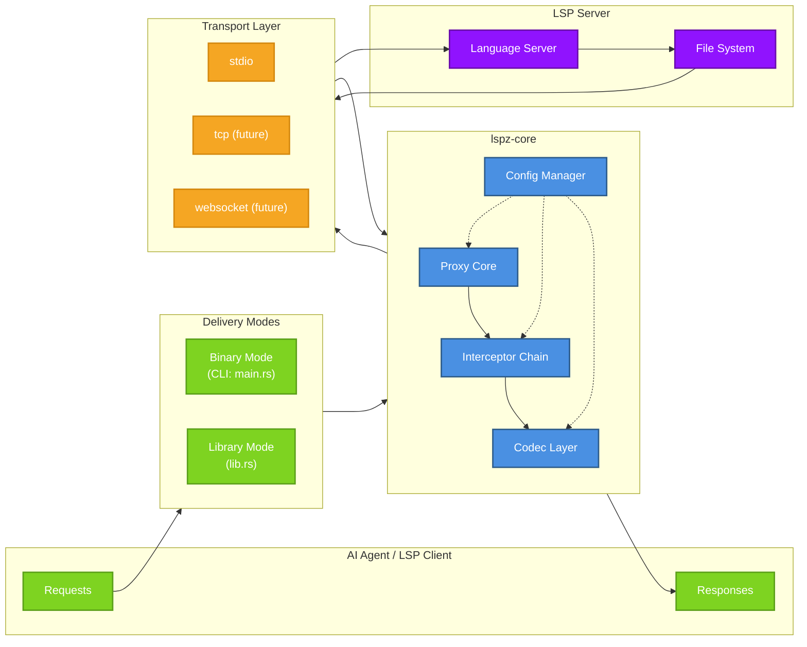
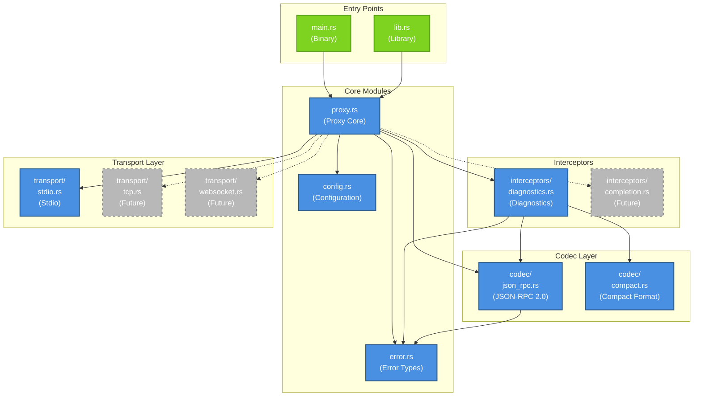
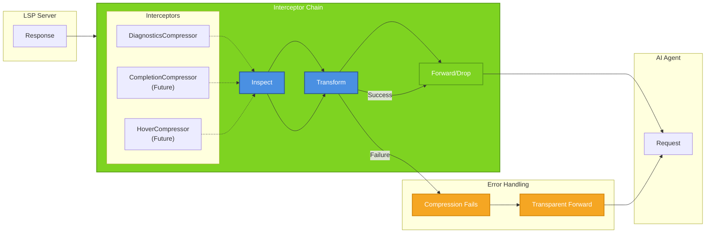
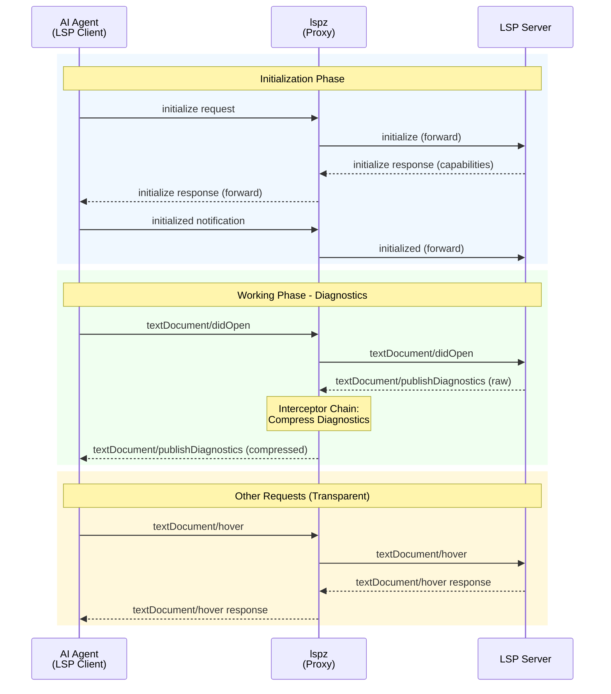

# lspz MVP 产品需求文档 v2.0

> NOTE: LSP 服务器信息已整合到 [docs/specs/003-lsp-compatibility.md](../specs/003-lsp-compatibility.md)

## 1. 项目代号与含义
**lspz**
- 全称：**lsp zip**（LSP 压缩代理）
- 象形：字母 `z` 可视作双向箭头 `→←`，象征透明代理的双向通信
- 定位：轻薄、高速、无感，像拉链一样把 LSP 输出“压缩”起来

## 2. 项目目标
构建一个**对 AI Coding Agent 极其友好的 LSP 代理层**，既可作为独立二进制透明部署，更可以作为 Rust 库被直接嵌入任何 Agent CLI 中。
核心优化：对 **Server → Client** 方向的结构化 LSP 消息（优先诊断）进行 Token 敏感的无损压缩，让 LLM 用更少的上下文理解更多代码问题，同时保持所有 LSP 标准接口的兼容性。

## 3. 核心用户与使用场景
- **首要用户**：即将开发的 **Coding Agent CLI**（由你本人维护），需要原生集成 `lspz`，对外表现为标准 LSP Server，对内进行智能压缩。
- **次要用户**：其他 AI Coding Agent 的开发者（如 Continue、Cody 等），可直接使用 `lspz` 独立二进制，无需修改 Agent 代码。

## 4. MVP 范围
### 4.1 核心功能：`textDocument/publishDiagnostics` 压缩
**为什么先做诊断**：诊断消息是最常见、最冗余的 LSP 输出，也是 Agent 依赖的关键上下文。

**支持的压缩策略（均可通过 config 开启/关闭）**：

| 策略 | 描述 |
|------|------|
| 去重合并 | 同一文件中相同 `message` 且相同 `severity` 的诊断合并为一个条目，`ranges` 平铺 |
| 字段裁剪 | 移除非关键字段（`data`, `codeDescription`, `relatedInformation` 等），可配置保留哪些字段 |
| 枚举缩减 | `severity` 转为单字符：`1→E, 2→W, 3→I, 4→H`；`tags` 同理 |
| Range 编码 | 多个 range 记录时采用数组+delta 编码，避免重复字段名 |

**压缩流程**：



**输出格式**：压缩后仍为合法的 JSON-RPC `textDocument/publishDiagnostics` 通知，但 `params.diagnostics` 结构可为自定义紧凑格式（Agent 端需能解析，提供参考实现）。

### 4.2 兼容性与标准
- 遵循 LSP 3.17 核心规范（参考 [specification](https://microsoft.github.io/language-server-protocol/specifications/lsp/3.17/specification/)）
- 正确处理 `initialize` / `initialized` 握手与能力协商
- 对不支持的请求/通知透明转发，不破坏标准

## 5. 架构设计（核心）
### 5.1 双模式交付，统一核心



**解释**：
- `lspz-core` 是纯逻辑库，不依赖任何特定传输方式，可以被任何 Rust 项目（比如你的 Coding Agent CLI）通过 Cargo 依赖直接使用。
- 独立二进制 `lspz` 只是 `lspz-core` 的一个薄壳，负责从命令行参数构造 config 并启动 stdio 通信。
- 未来你开发 Agent CLI 时，可以直接在代码里 `use lspz_core::Proxy;`，设置配置，然后就能在以库的形式获得完整的代理能力，Agent 本身可以同时扮演 LSP Client 的角色。

### 5.2 内部模块划分（lspz-core）
```
src/
├── main.rs               # 独立二进制入口
├── lib.rs                # 库入口，暴露 public API
├── proxy.rs              # 核心代理：管理生命周期、消息转发、拦截器调用
├── interceptors/
│   ├── mod.rs
│   └── diagnostics.rs    # 诊断压缩拦截器
├── codec/
│   ├── mod.rs
│   ├── json_rpc.rs       # JSON-RPC 2.0 消息解析与序列化
│   └── compact.rs        # 紧凑格式的实现（用于压缩后的诊断表示）
├── transport/
│   ├── mod.rs
│   └── stdio.rs          # stdio 通信实现
├── config.rs             # 配置结构与解析
└── error.rs              # 统一错误类型
```

**模块依赖关系**：



**关键设计原则**：
- **拦截器链**：`proxy.rs` 维护一个拦截器列表，每个拦截器都可以对 Server→Client 消息进行检查和变形。诊断压缩只是第一个拦截器，后续可添加补全压缩、hover 压缩等。
- **配置驱动**：所有压缩行为通过 `Config` 控制，Agent 可以轻松在代码中构建特定配置的代理实例。
- **错误隔离**：压缩逻辑失败不应导致代理崩溃，应记录错误日志并回退到透明转发。

**拦截器链处理流程**：



### 5.3 请求/响应流程图（Mermaid）



## 6. 配置与环境变量
MVP 期主要使用环境变量，库模式使用 Rust 结构体。

| 变量名 | 说明 | 默认值 |
|--------|------|--------|
| `LSPZ_BACKEND_CMD` | 后端 LSP 启动命令 | 无（库模式可编程指定） |
| `LSPZ_ENABLE_DIAG_COMPRESS` | 启用诊断压缩 | `false` |
| `LSPZ_DIAG_FIELDS` | 诊断保留字段列表 | `message,severity,range,code` |
| `LSPZ_DIAG_MERGE` | 是否合并相同诊断 | `true` |
| `LSPZ_LOG_LEVEL` | 日志级别 | `warn` |

库模式对应 `Config` struct，字段清晰。

## 7. 测试与验证目标
### 7.1 集成测试目标 LSP 服务器
- **basedpyright** (Python)
- **gopls** (Go)
- **typescript-language-server** 或 **typescript-go** (微软新版)
- **rust-analyzer** (Rust)

### 7.2 测试方法
- 使用测试代码（Rust 集成测试）加载 `lspz-core`，直接创建 Proxy 并向后端 LSP 注入消息，不依赖 stdio。
- 模拟打开带有错误的文件，观察 `publishDiagnostics` 输出，对比压缩前后字符数及 Token 数（使用 `tiktoken-rs` 模拟 GPT-4 tokenizer）。
- 目标：典型场景下 Token 数降低 ≥ 40%，且压缩后的内容能被标准解析器还原到原始关键信息（至少文件、行号、严重级别、消息无误）。

## 8. 交付物
- `Cargo.toml` 工作区（workspace），包含：
  - `lspz-core` 库
  - `lspz` 二进制
- README.md：项目介绍、架构图、快速开始、压缩策略说明
- 示例文件夹 `/examples/agent_demo.rs`：展示如何以库模式在 Rust Agent 中集成 lspz
- 参考压缩格式文档 `docs/compact_format.md`
- CI：`cargo test` 包含单元测试与集成测试，至少运行 gopls 与 rust-analyzer 的简单场景

## 9. 后续扩展规划（非 MVP）
- 其他消息类型压缩（`completion`, `hover`, `documentSymbol` 等）
- 支持 TCP / WebSocket 传输
- 动态拦截器配置热加载
- 详细的 metrics 与 tracing
- Agent 端标准解压库（Rust 及其他语言）

## 10. 任务拆分（逻辑顺序，可并行）
1. **项目初始化**
   - 创建 workspace，搭建 `lspz-core` 库与 `lspz` 二进制骨架
   - 引入核心依赖：`tokio`, `serde`, `serde_json`, `tower-lsp`（或自研 LSP 框架）、`tiktoken-rs`

2. **消息解析与基础通信层**
   - 实现 JSON-RPC 2.0 消息编解码
   - 实现 stdio transport
   - 实现消息循环：接收→解析→分发

3. **透明代理核心**
   - 实现 `initialize` / `initialized` 握手逻辑，能力协商
   - 实现普通请求/响应的透明转发

4. **拦截器框架**
   - 定义拦截器 trait
   - 在代理主循环中插入拦截器调用点
   - 实现第一个拦截器：诊断压缩

5. **诊断压缩实现**
   - 去重合并算法
   - 字段裁剪
   - 枚举编码
   - Range 数组压缩

6. **配置管理**
   - 环境变量解析
   - 库模式 Config 构建

7. **测试**
   - 单元测试（算法正确性）
   - 集成测试（与至少两个真实 LSP 后端交互，验证压缩率和语义完整性）

8. **文档与示例**
   - README
   - `agent_demo.rs` 示例
   - 压缩格式说明
