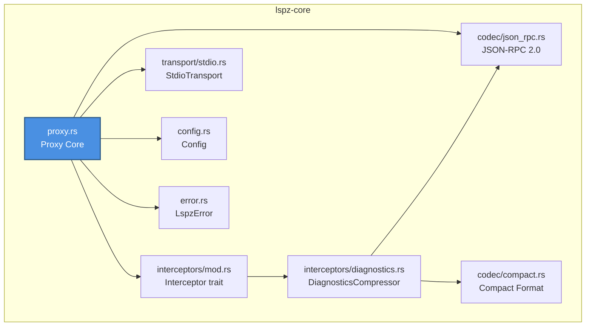

# lspz MVP 阶段计划 (v0.1)

**阶段**: Phase 1 - MVP
**版本**: v0.1.0
**状态**: ⏳ 待开始
**预计周期**: 4-6 周

## 目标

实现 lspz 的核心功能，支持 **Library Mode** 和 **Proxy Mode** 两种产品形态。

### 核心交付物

1. **lspz-core** (v0.1.0) - 核心库 crate
2. **lspz** (v0.1.0) - CLI 二进制
3. 基础测试覆盖（rust-analyzer, gopls）
4. 使用示例和文档

---

## 技术决策

### 核心依赖

| 依赖 | 版本 | 用途 |
|------|------|------|
| Rust | 2024 edition | 基础语言 |
| tokio | 1.35+ | 异步运行时 |
| serde | 1.0+ | 序列化框架 |
| serde_json | 1.0+ | JSON 支持 |
| async-trait | 0.1+ | 异步 trait |
| thiserror | 1.0+ | 错误类型定义 |
| tracing | 0.1+ | 结构化日志 |
| clap | 4.0+ | CLI 参数解析（仅 binary） |

### 关键决策: 自实现 JSON-RPC vs tower-lsp

**决策**: 自实现轻量级 JSON-RPC 编解码层

**原因**:
1. `tower-lsp` 是一个完整的 LSP 服务端框架，包含大量 lspz 不需要的功能（协议处理、能力协商、请求路由等）
2. lspz 只需要 JSON-RPC 2.0 消息的编解码 + 透明转发，不需要完整的 LSP 框架
3. 自实现可以精确控制消息边界解析 (`Content-Length` header)、错误处理逻辑
4. 依赖更少，编译更快，二进制更小

**实现内容**: `codec/json_rpc.rs` 实现基于 `Content-Length` header 的消息帧解析。

### 压缩策略实现顺序

根据调研结果，按收益从高到低实现：

1. **去重合并** (#1 收益): 按 (message, severity, code) 哈希分组 → 合并 ranges → 计数
2. **Range 数组编码** (#2 收益): 从 `{start:{line,col},end:{line,col}}` → `[line_s,col_s,line_e,col_e]`
3. **枚举缩减** (#3 收益): severity 映射 E/W/I/H，tags 映射 U/D
4. **字段裁剪** (#4 收益): 配置式保留/丢弃字段

---

## 实施计划

### Task A: 基础设施 (Week 1)

**目标**: 搭建项目骨架，实现基础通信

```
[Task A1] 工作区结构
  - 创建 lspz-core / lspz 两个 crate
  - Cargo.toml 依赖配置
  - CI/CD (GitHub Actions)

[Task A2] Codec 层 ← 第一个检查点
  - JSON-RPC 2.0 Content-Length 帧解析
  - LspMessage 枚举 (Request/Response/Notification)
  - 单元测试 ≥ 90%

[Task A3] Transport 层
  - Transport trait 定义
  - StdioTransport 实现（子进程启动 + stdio）
```

**检查点**: Codec 层完成后 → `just qa` → commit → `v0.1.0-alpha.1`

---

### Task B: Proxy 核心 (Week 2)

**目标**: 实现 LSP 代理核心逻辑

```
[Task B1] 错误类型 + 配置
  - LspzError 枚举 (thiserror)
  - Config builder + env var 解析

[Task B2] Proxy Core ← 第二个检查点
  - Proxy 状态机 (Created→Initializing→Ready→Working→ShuttingDown)
  - initialize/initialized 握手
  - Client→Server 透明转发
  - Server→Client 消息路由到 Interceptor 链

[Task B3] CLI 入口
  - clap 参数解析
  - tracing/log 初始化
  - 信号处理 (SIGTERM/SIGINT → 优雅关闭)
```

**检查点**: Proxy 核心完成后 → `just qa` → commit → `v0.1.0-alpha.2`

---

### Task C: Interceptor 框架 + 诊断压缩 (Week 3-4)

**目标**: 实现可扩展的拦截器链和诊断压缩

```
[Task C1] Interceptor 框架
  - Interceptor trait 定义
  - 拦截器链 (Vec<Box<dyn Interceptor>>)
  - MessageTypeRouter (Router interceptor)
  - PassthroughInterceptor (默认 fallback)

[Task C2] 诊断压缩 — Dedup (#1) ← 第三个检查点
  - 按 (message, severity, code) 哈希分组
  - ranges 数组合并
  - "n" 计数

[Task C3] 诊断压缩 — Range + Enum + Field
  - Range 数组编码 ([line, char, line, char])
  - Range delta 编码（多个 range 时）
  - Severity→E/W/I/H 映射
  - 字段裁剪 (配置式 keep/drop)

[Task C4] CompactFormat 编解码
  - CompactDiagnostics 序列化/反序列化
  - 版本号处理
```

**检查点**: 诊断压缩完成后 → `just qa` → commit → `v0.1.0-rc.1`

---

### Task D: 测试 + 文档 + 发布 (Week 5-6)

```
[Task D1] 集成测试
  - rust-analyzer 端到端测试
  - gopls 端到端测试
  - Token 节省验证 (≥ 40%)

[Task D2] 示例代码
  - examples/agent_demo.rs (Library Mode)
  - CLI 使用文档

[Task D3] 文档
  - 更新 README.md
  - 从代码注释生成 .gen. 文档
  - 架构图验证

[Task D4] 发布 ← MVP 正式版
  - 版本号 v0.1.0
  - git tag v0.1.0
  - CHANGELOG.md
  - 发布到 crates.io (可选)
```

**检查点**: MVP 发布 → `v0.1.0` 正式版

---

## 模块依赖关系



---

## 扩展点预留

### 1. 拦截器链

```rust
// MVP: 固定顺序的拦截器列表
let chain = InterceptorChain::new(vec![
    Box::new(MessageTypeRouter::new()),
    Box::new(DiagnosticsCompressor::new(config.compression)),
]);

// 预留未来: 动态注册 + 优先级
// proxy.register_interceptor(Box::new(CustomInterceptor::new()))?;
// chain.set_priority("custom", 10)?;
```

### 2. 传输层

```rust
// MVP: stdio 固定
let transport: Box<dyn Transport> = Box::new(StdioTransport::new(cmd)?);

// 预留未来: TCP/WS
// let transport = match config.transport_type {
//     TransportType::Tcp => Box::new(TcpTransport::new(&addr)?),
//     TransportType::WebSocket => Box::new(WebSocketTransport::new(&url)?),
// };
```

### 3. Metrics/Tracking 钩子

```rust
// MVP: 简单的 tracing 日志
tracing::info!(savings_pct = %pct, "Diagnostics compressed");

// 预留未来: SQLite tracking (参考 rtk)
// tracking.record(DiagnosticRecord { file, original_tokens, compressed_tokens, savings_pct });
```

---

## 测试策略

### Token 节省验证

```rust
// 集成测试: Open file with errors → capture compact output → count tokens
#[tokio::test]
async fn test_token_savings() {
    let savings = run_compression_test("rust-analyzer", "test_data/error_file.rs").await;
    assert!(savings >= 0.40, "Expected ≥40% token savings, got {:.1}%", savings * 100.0);
}
```

### 性能目标

| 指标 | 目标 |
|------|------|
| 压缩率 | ≥ 40% |
| 压缩延迟 | ≤ 10ms |
| 内存占用 | ≤ 50MB |
| 启动时间 | ≤ 100ms |

---

## 风险和缓解

| 风险 | 影响 | 概率 | 缓解措施 |
|------|------|------|----------|
| LSP 协议兼容性问题 | 高 | 中 | 严格遵循 LSP 3.17 规范，充分测试 |
| 压缩算法性能问题 | 中 | 低 | 基准测试，必要时优化 |
| 不同 LSP server 差异 | 高 | 高 | 测试多个 server，抽象差异 |
| Agent 内部已有格式化 | 中 | 中 | 调研 OpenCode 已完成，验证压缩增量收益 |

---

## 下一步

完成 MVP 后，进入 Phase 2: MCP 集成。

---

## 参考文档

- [ROADMAP.md](../../ROADMAP.md) - 项目路线图
- [specs/001-tri-modal-architecture.md](../specs/001-tri-modal-architecture.md) - 三模态架构
- [specs/002-compression-format.md](../specs/002-compression-format.md) - 压缩格式规范
- [specs/004-ssot-rules.md](../specs/004-ssot-rules.md) - SSOT 规则
