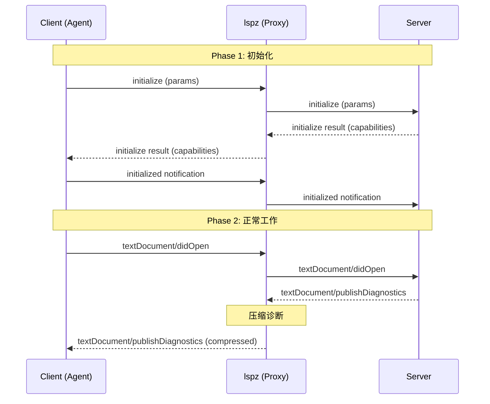

# lspz LSP 兼容性规范

**版本**: v0.1.0
**LSP 版本**: 3.17
**状态**: 草案
**最后更新**: 2026-05-09

## 概述

lspz 必须完全符合 [Language Server Protocol 3.17](https://microsoft.github.io/language-server-protocol/specifications/lsp/3.17/specification/) 规范，确保与任何标准 LSP 客户端和服务器兼容。

### 兼容性原则

1. **不破坏标准**: 永不违反 LSP 规范
2. **透明转发**: 非目标消息必须透明转发
3. **能力协商**: 正确处理 server/client capabilities
4. **错误隔离**: 压缩失败不影响 LSP 通信

---

## 支持的 LSP 消息

### 完全支持（透明转发）

| 类别 | 消息 | 说明 |
|------|------|------|
| **生命周期** | `initialize` | 客户端初始化 |
| | `initialized` | 初始化完成通知 |
| | `shutdown` | 关闭请求 |
| | `exit` | 退出通知 |
| **文档同步** | `textDocument/didOpen` | 打开文档 |
| | `textDocument/didChange` | 文档变更 |
| | `textDocument/didClose` | 关闭文档 |
| | `textDocument/didSave` | 保存文档 |
| **语言特性** | `textDocument/hover` | 悬停提示 |
| | `textDocument/completion` | 代码补全 |
| | `textDocument/definition` | 跳转定义 |
| | `textDocument/references` | 查找引用 |
| | `textDocument/documentSymbol` | 文档符号 |
| | `textDocument/codeAction` | 代码操作 |
| **工作区** | `workspace/didChangeConfiguration` | 配置变更 |
| | `workspace/executeCommand` | 执行命令 |

### 拦截处理（压缩后转发）

| 消息 | 处理方式 | 压缩策略 |
|------|----------|----------|
| `textDocument/publishDiagnostics` | 压缩后转发 | 诊断压缩（详见 [002-compression-format.md](002-compression-format.md)） |

---

## LSP 初始化流程

### 标准握手序列



### Initialize 参数

**Client → Server** (lspz 透明转发):

```json
{
  "jsonrpc": "2.0",
  "id": 1,
  "method": "initialize",
  "params": {
    "processId": 12345,
    "rootUri": "file:///path/to/project",
    "capabilities": {
      "textDocument": {
        "publishDiagnostics": {
          "relatedInformation": true,
          "codeDescriptionSupport": true,
          "dataSupport": true
        }
      }
    }
  }
}
```

**Server → Client** (lspz 透明转发):

```json
{
  "jsonrpc": "2.0",
  "id": 1,
  "result": {
    "capabilities": {
      "textDocumentSync": 1,
      "hoverProvider": true,
      "completionProvider": {
        "resolveProvider": false
      },
      "diagnosticProvider": {}
    }
  }
}
```

---

## 能力协商

### lspz 在能力协商中的角色

**lspz 不修改 capabilities**:

- lspz 透明转发 Server 的 capabilities
- lspz 不声明任何额外的能力
- lspz 不过滤 Client 的 capabilities

### 原因

保持 lspz 对 LSP 客户端和服务器完全透明：
- 客户端认为直接与 Server 通信
- 服务器认为直接与 Client 通信
- lspz 仅作为中间压缩层

---

## 诊断消息处理

### 标准 publishDiagnostics

**Server → lspz** (标准格式):

```json
{
  "jsonrpc": "2.0",
  "method": "textDocument/publishDiagnostics",
  "params": {
    "uri": "file:///path/to/file.rs",
    "diagnostics": [
      {
        "range": {
          "start": {"line": 10, "character": 5},
          "end": {"line": 10, "character": 15}
        },
        "severity": 2,
        "message": "unused variable"
      }
    ]
  }
}
```

**lspz → Client** (压缩格式):

```json
{
  "jsonrpc": "2.0",
  "method": "textDocument/publishDiagnostics",
  "params": {
    "version": 1,
    "uri": "file:///path/to/file.rs",
    "diagnostics": [
      {
        "m": "unused variable",
        "s": "W",
        "r": [[10, 5, 10, 15]]
      }
    ]
  }
}
```

### 关键约束

1. **消息结构不变**: 仍然是 JSON-RPC 2.0 通知
2. **方法名不变**: `textDocument/publishDiagnostics`
3. **URI 不变**: `params.uri` 保持原值
4. **只压缩 diagnostics**: `params.diagnostics` 内容压缩

---

## 错误处理

### JSON-RPC 错误

lspz 正确转发和处理 JSON-RPC 错误：

```json
{
  "jsonrpc": "2.0",
  "id": 1,
  "error": {
    "code": -32601,
    "message": "Method not found"
  }
}
```

### LSP 错误响应

lspz 透明转发 LSP 错误响应：

```json
{
  "jsonrpc": "2.0",
  "id": 2,
  "error": {
    "code": -32800,
    "message": "Request cancelled"
  }
}
```

### lspz 内部错误

**原则**: lspz 内部错误不应中断 LSP 通信

| 错误类型 | 处理方式 | 日志级别 |
|---------|----------|----------|
| 压缩失败 | 降级到透明转发 | WARN |
| 配置错误 | 记录日志，继续运行 | ERROR |
| 传输错误 | 返回 JSON-RPC 错误 | ERROR |
| 解析错误 | 返回 JSON-RPC 错误 | ERROR |

**示例**:

```rust
// 压缩失败时的降级处理
match compress_diagnostics(diagnostics) {
    Ok(compressed) => send_compressed(compressed),
    Err(e) => {
        warn!("Compression failed: {}", e);
        // 降级到透明转发
        send_original(diagnostics);
    }
}
```

---

## 服务器兼容性测试

### 目标 LSP 服务器

| LSP Server | 语言 | 测试优先级 | 调用方式 | 参考源码 | 已测试 |
|-----------|------|-----------|----------|----------|--------|
| basedpyright | Python | P0 | `basedpyright` | `../basedpyright` | ⏳ |
| rust-analyzer | Rust | P0 | `rust-analyzer` | `../rust-analyzer` | ⏳ |
| typescript-language-server | TypeScript/JavaScript | P1 | `typescript-language-server` | `../typescript-language-server` | ⏳ |
| gopls | Go | P2 | `gopls` | `../golang.tools/gopls/` | ⏳ |

**说明**:
- 对于实施阶段，可以使用当前环境中已有的相关 server
- 参考源码可以在项目父目录 `../` 中找到
- 测试前确保 LSP server 已安装并可调用

### 测试矩阵

| LSP Server | initialize | diagnostics | hover | completion | 其他 |
|-----------|-----------|-------------|-------|-----------|------|
| rust-analyzer | ✅ | ✅ | ✅ | ✅ | ⏳ |
| gopls | ✅ | ✅ | ✅ | ✅ | ⏳ |
| basedpyright | ✅ | ✅ | ✅ | ✅ | ⏳ |
| typescript-language-server | ✅ | ✅ | ✅ | ✅ | ⏳ |

---

## 客户端兼容性

### 目标 LSP 客户端

| 客户端 | 压缩感知 | 兼容性 |
|-------|----------|--------|
| Claude Code | ❌ | ✅ 透明 |
| Continue | ❌ | ✅ 透明 |
| VS Code (LSP) | ❌ | ✅ 透明 |
| 自研 Agent | ✅ | ✅ 可选 |

### 压缩感知模式

对于支持压缩的客户端（如自研 Agent），lspz 提供：

1. **配置选项**: 控制是否启用压缩
2. **格式协商**: Client 可以请求标准格式
3. **版本声明**: 压缩格式版本号

```rust
// Client 请求标准格式
let config = Config {
    enable_diag_compress: false,  // 禁用压缩
    ..Default::default()
};
```

---

## 未支持的消息

### 暂不支持但透明转发

- `window/` 前缀的窗口相关消息
- `$/` 前缀的特定协议消息
- 实验性消息

### 未来可能支持

| 消息 | 优先级 | 计划版本 |
|------|--------|----------|
| `textDocument/completion` | P1 | v0.2 |
| `textDocument/hover` | P2 | v0.3 |
| `textDocument/documentSymbol` | P2 | v0.3 |

---

## 实现检查清单

### LSP 规范合规

- [ ] 正确处理 JSON-RPC 2.0 基础协议
- [ ] 支持请求、响应、通知三种消息类型
- [ ] 正确处理消息 id
- [ ] 正确转发 JSON-RPC 错误
- [ ] 实现完整的 initialize/initialized 握手
- [ ] 透明转发所有非诊断消息
- [ ] 正确处理 capabilities
- [ ] 压缩失败时降级到透明转发

### 测试覆盖

- [ ] rust-analyzer 集成测试通过
- [ ] gopls 集成测试通过
- [ ] 至少 2 个其他 LSP 服务器测试通过
- [ ] 压缩格式可正确还原
- [ ] Token 节省 ≥ 40%

---

## 参考文档

- [LSP 3.17 规范](https://microsoft.github.io/language-server-protocol/specifications/lsp/3.17/specification/)
- [JSON-RPC 2.0 规范](https://www.jsonrpc.org/specification)
- [specs/002-compression-format.md](002-compression-format.md) - 压缩格式规范
- [specs/001-tri-modal-architecture.md](001-tri-modal-architecture.md) - 三模态架构
