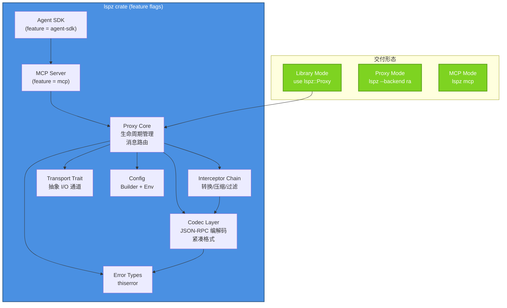
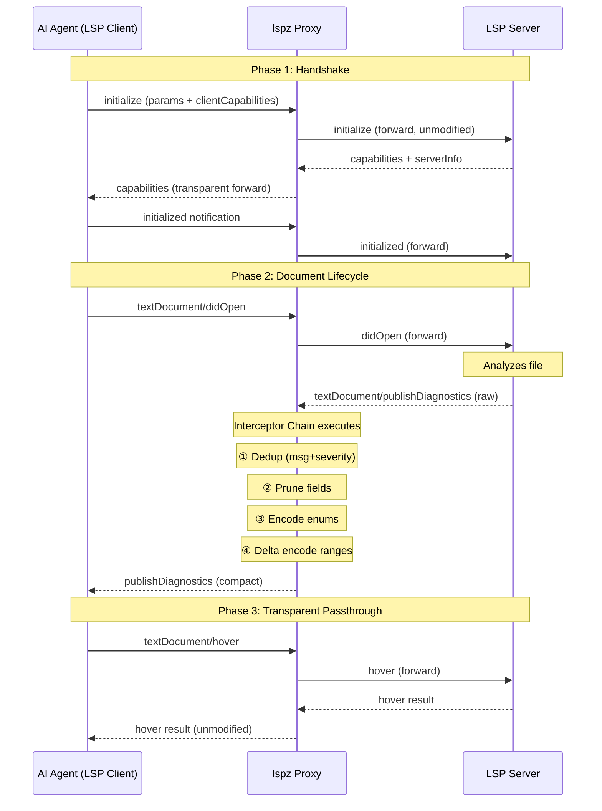
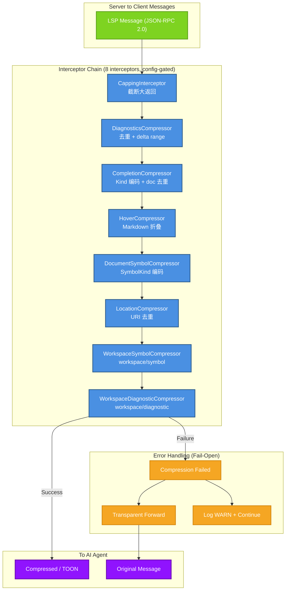
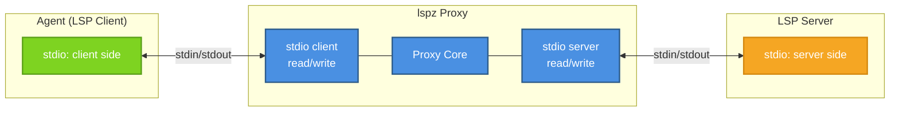
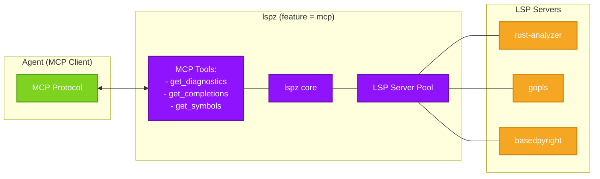
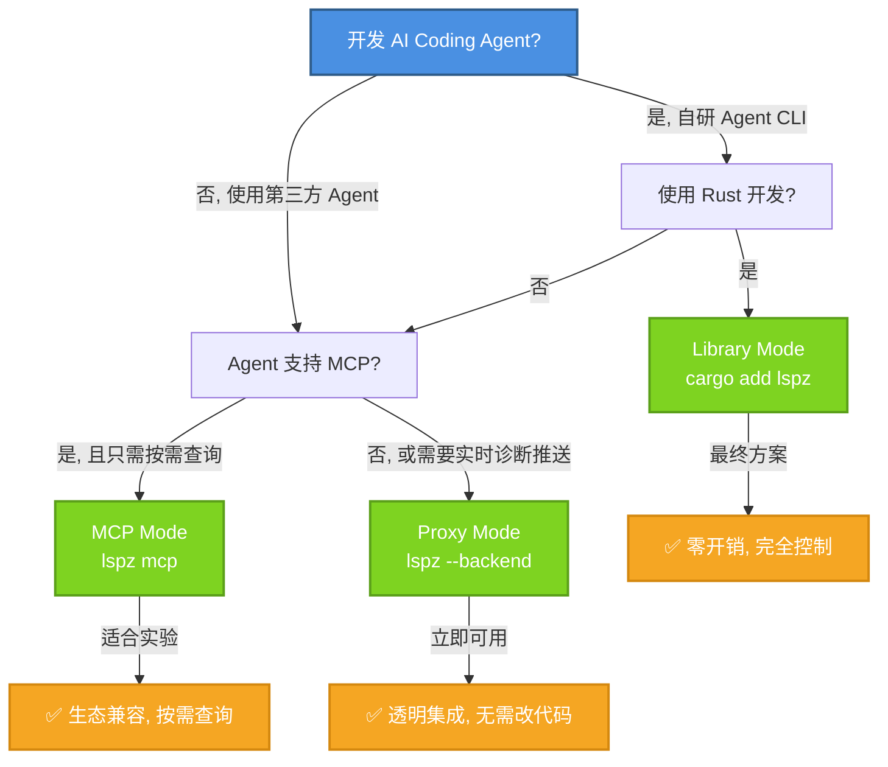
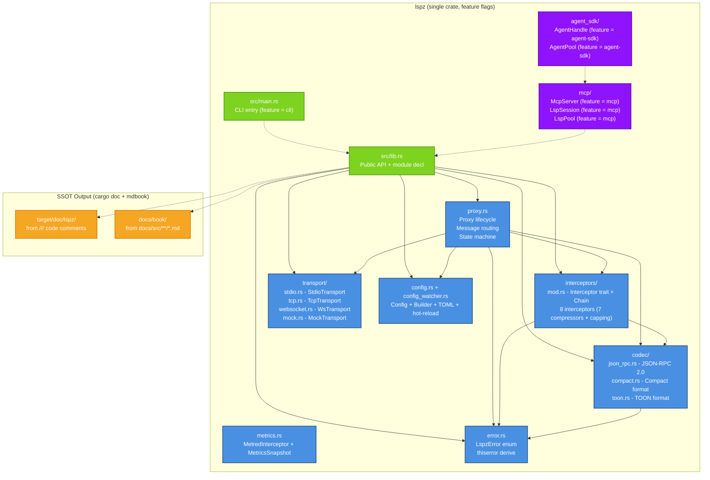

# lspz 三模态架构规格

**版本**: v0.9.2
**状态**: 定稿
**最后更新**: 2026-05-15

## 概述

lspz 采用三模态架构设计，支持作为库、LSP 代理、MCP 服务器三种产品形态。本文档定义这三种模式的设计原则、接口边界和协作方式。

---

## 架构总览



---

## 完整消息流



---

## Proxy 核心状态机

```mermaid
stateDiagram-v2
    [*] --> Created: Proxy::new(config)
    Created --> Initializing: initialize()
    Initializing --> Ready: initialized received
    Initializing --> ShuttingDown: shutdown received
    Ready --> Working: message loop
    Working --> Ready: continue
    Working --> ShuttingDown: shutdown received
    ShuttingDown --> Exited: exit notification
    Exited --> [*]

    state Ready {
        [*] --> Idle
        Idle --> Forwarding: Client→Server msg
        Forwarding --> Idle: msg forwarded
        Idle --> Intercepting: Server→Client msg
        Intercepting --> Compressing: matched interceptor
        Intercepting --> Forwarding: no match (passthrough)
        Compressing --> Idle: compressed msg sent
        Compressing --> Forwarding: compression failed (fallback)
    }
```

---

## 拦截器链架构



---

## Proxy 消息循环

```mermaid
flowchart TB
    subgraph 初始化["初始化阶段"]
        I1["Proxy::start()"]
        I2["发送 initialize 请求"]
        I3["等待 initialize 响应"]
        I4["发送 initialized 通知"]
        I5["保存 ServerCapabilities"]
    end

    subgraph 主循环["消息循环"]
        L1["等待下一条消息 (tokio::select!)"]
        L2["消息来源?"]
        L3["Client to Server: 透明转发给 LSP 后端"]
        L4["Server to Client: 进入拦截器链"]
        L5["拦截器链处理"]
        L6["发送给 Client"]
    end

    subgraph 关闭["关闭流程"]
        S1["shutdown() 被调用"]
        S2["发送 shutdown 请求"]
        S3["发送 exit 通知"]
        S4["杀死 server 子进程"]
    end

    I1 --> I2 --> I3 --> I4 --> I5
    I5 --> L1
    L1 --> L2
    L2 -->|"来自 Client (stdin)"| L3 --> L1
    L2 -->|"来自 Server (子进程 stdout)"| L4 --> L5 --> L6 --> L1
    L1 -->|"退出信号 / 错误"| S1 --> S2 --> S3 --> S4

    classDef init fill:#4A90E2,stroke:#2E5C8A,stroke-width:2px,color:#fff
    classDef loop fill:#7ED321,stroke:#5BA01A,stroke-width:2px,color:#fff
    classDef end fill:#F5A623,stroke:#D4880F,stroke-width:2px,color:#fff

    class I1,I2,I3,I4,I5 init
    class L1,L2,L3,L4,L5,L6 loop
    class S1,S2,S3,S4 end
```

**消息循环关键细节**:

- 使用 `tokio::select!` 同时等待 Client stdin 和 Server stdout 两条消息源
- Client→Server 消息**不做任何处理**，直接序列化写入子进程 stdin
- Server→Client 消息**通过拦截器链后再发送**给 Client
- 拦截器链中任何一步失败 → `tracing::warn!` + 透明转发原始消息
- 信号处理: SIGTERM/SIGINT → 触发 `shutdown()` → 优雅关闭

---

## 模式 1: Library Mode (作为库)

### 设计目标

为自研 Agent CLI 提供完全控制的 Rust 库 LSP 压缩能力，零运行时开销。

### 核心 Traits

```rust
/// 传输层抽象，定义 I/O 通道的基本操作。
///
/// # 实现者
///
/// - `StdioTransport` (MVP)
/// - `TcpTransport`
/// - `WsTransport` (feature-gated)
#[async_trait]
pub trait Transport: Send + Sync {
    /// 接收一条原始 LSP 消息（按 Content-Length 分割）。
    async fn receive(&mut self) -> Result<Vec<u8>, LspzError>;
    /// 发送一条原始 LSP 消息。
    async fn send(&mut self, data: &[u8]) -> Result<(), LspzError>;
}

/// 拦截器 trait，核心扩展点。
///
/// 每个拦截器可以检查并选择性转换消息。
/// 拦截器链在 Proxy 内部按注册顺序执行。
#[async_trait]
pub trait Interceptor: Send + Sync {
    /// 拦截器唯一名称（用于排序和配置）。
    fn name(&self) -> &str;
    /// 判断是否处理该消息。
    fn applies_to(&self, method: &str, direction: Direction) -> bool;
    /// 转换消息 params。Ok(None) = 丢弃，Ok(Some(params)) = 替换。
    /// 默认实现：不做任何修改。
    async fn intercept(
        &self,
        method: &str,
        params: serde_json::Value,
        direction: Direction,
    ) -> Result<Option<serde_json::Value>, LspzError> {
        Ok(Some(params))
    }
}

/// 消息方向。
#[derive(Debug, Clone, Copy, PartialEq, Eq)]
pub enum Direction {
    ClientToServer,
    ServerToClient,
}

/// 解析后的 LSP 消息。
#[derive(Debug)]
pub enum LspMessage {
    Request { id: i64, method: String, params: serde_json::Value },
    Response { id: i64, result: Option<serde_json::Value>, error: Option<JsonRpcError> },
    Notification { method: String, params: serde_json::Value },
}
```

### 使用示例

```rust
use lspz::{Proxy, Config, StdioTransport};

#[tokio::main]
async fn main() -> Result<()> {
    let config = Config::builder()
        .backend_cmd("rust-analyzer")
        .enable_diag_compress(true)
        .build()?;

    let transport = StdioTransport::new("rust-analyzer")?;
    let mut proxy = Proxy::new(config, Box::new(transport));

    proxy.start().await?;          // 执行握手
    proxy.open_file(uri).await?;   // 打开文件
    let diags = proxy.diagnostics(uri).await?; // 获取（已压缩的）诊断

    // diags 已经是 CompactDiagnostics 格式
    Ok(())
}
```

### 关键约束

1. **API 稳定性**: 公共 API 在主版本不变时承诺向后兼容
2. **异步设计**: 所有 I/O 操作基于 tokio 异步
3. **错误处理**: 使用 `Result<T, LspzError>` 统一错误类型

### 特点

| 特性 | 说明 |
|------|------|
| 集成方式 | Cargo 依赖，代码级集成 |
| 传输层 | 可自定义（stdio/TCP/WS） |
| 生命周期 | 由 Agent 控制 |
| 配置方式 | Rust 结构体，类型安全 |
| 适用场景 | 自研 Agent，需要完全控制 |

---

## 模式 2: Proxy Mode (LSP 代理)

### 设计目标

为现有 Agent（Claude Code、Continue、Cody、OpenCode）提供即插即用的透明代理。

### 架构



### 使用方式

```bash
# 配置 Agent 的 LSP server 为 lspz
cargo run -- --backend rust-analyzer

# lspz 自动启动真实 LSP server 并代理通信
# 所有 Server→Client 的诊断消息被自动压缩
```

### 特点

| 特性 | 说明 |
|------|------|
| 集成方式 | 独立进程，stdio 通信 |
| 传输层 | 固定使用 stdio |
| 生命周期 | 进程级 |
| 配置方式 | 环境变量 + CLI 参数 |
| 适用场景 | 第三方 Agent，无需修改代码 |

### 关键约束

1. **LSP 兼容性**: 必须完全符合 LSP 3.17 规范
2. **透明性**: Agent 感知不到代理的存在
3. **错误隔离**: 压缩失败不影响 LSP 通信，回退到透明转发

---

## 模式 3: MCP Mode (MCP 服务器)

### 设计目标

为快速实验和多工具协同提供 MCP 协议集成。

### 架构



### MCP Tools

| Tool | 描述 | 返回值 |
|------|------|--------|
| `get_diagnostics` | 获取文件诊断（压缩格式） | CompactDiagnostics |
| `get_completions` | 获取代码补全 | CompactCompletionItems |
| `get_symbols` | 获取文档符号 | CompactSymbolList |

### 特点

| 特性 | 说明 |
|------|------|
| 集成方式 | MCP server |
| 传输层 | MCP 协议 |
| 生命周期 | Server 进程级 |
| 配置方式 | MCP 配置文件 |
| 适用场景 | 快速实验，多工具协同 |

---

## 模式选择指南



---

## 兼容性矩阵

| 功能 | Library | Proxy | MCP |
|------|----------|-------|-----|
| 诊断压缩 | ✅ | ✅ | ✅ |
| 自定义传输 | ✅ | ✅ (TCP/WS) | ❌ |
| 运行时配置 | ✅ | ✅ | ⚠️ |
| 热加载 | ✅ | ✅ | ⚠️ |
| 多 server | ✅ | ⚠️ | ✅ |
| 零额外开销 | ✅ | ❌ (进程间) | ❌ (MCP 协议) |

✅ 完全支持 | ⚠️ 部分支持 | ❌ 不支持

---

## Crate 结构



---

## 已实现扩展

### v0.2 (MCP 集成)
- [x] 实现完整的 MCP Mode
- [x] 添加 MCP tools (get_diagnostics, get_completions, get_symbols)
- [x] 多 LSP server 连接池 (LspPool)

### v0.3 (Agent SDK)
- [x] AgentHandle + AgentPool
- [x] 10 个查询方法 (diagnostics, completions, symbols, hover, references, definition, implementation, typeDefinition, workspace_symbols, workspace_diagnostics)

### v0.4+ (高级特性)
- [x] TCP/WebSocket 传输层
- [x] 动态配置热加载 (notify crate)
- [x] Metrics 和 Tracing (MetredInterceptor)

---

## 参考文档

- [ROADMAP.md](https://github.com/straydragon/lspz/blob/main/ROADMAP.md) - 项目路线图
- [压缩格式规范](./specs/compression-format.md)
- [LSP 兼容性](./specs/lsp-compatibility.md)
- [SSOT 规则](./specs/ssot-rules.md)
- [TOON 格式](./specs/toon-format.md)
