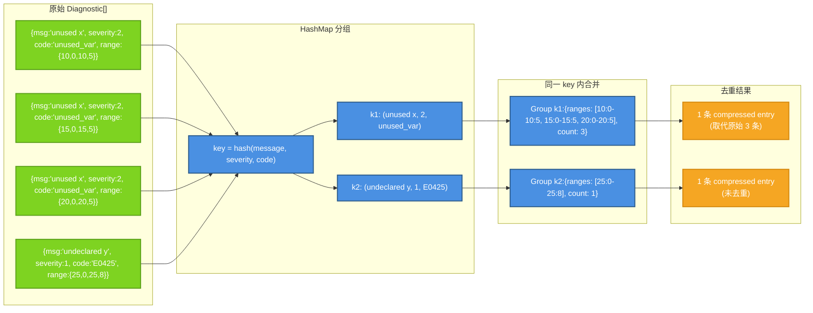
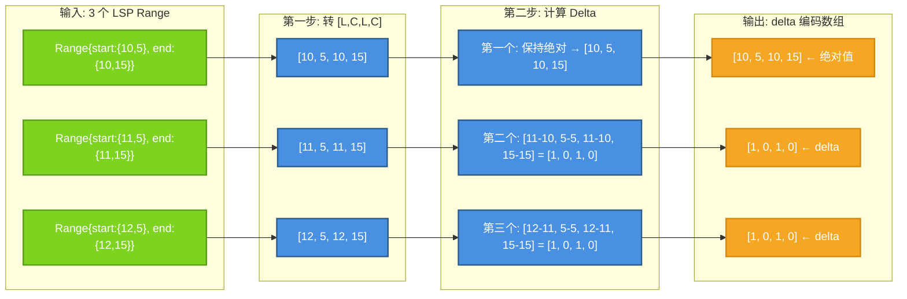

# lspz 压缩格式规范

**版本**: v0.1.0
**状态**: 定稿
**最后更新**: 2026-05-09

## 概述

本文档定义 lspz 使用的紧凑格式（Compact Format），用于压缩 LSP 诊断消息，减少 Token 消耗。

### 目标

- **Token 节省**: 相比原始 JSON 格式节省 ≥ 40% Token
- **语义完整**: 保留所有关键信息（文件、行号、严重级别、消息）
- **可还原**: Agent 端可以还原为标准 LSP Diagnostic 格式
- **可扩展**: 支持版本控制和向后兼容

---

## 调研发现: 为什么去重是最核心的压缩手段

### 真实 LSP 服务器的字段使用情况

对 3 个真实 LSP 服务器（jinja-lsp、typescript-language-server、yaml-language-server）的实际诊断输出分析：

| 字段 | jinja-lsp | typescript-LS | yaml-LS | 可裁剪？ |
|------|-----------|---------------|---------|---------|
| `range` | ✅ | ✅ | ✅ | ❌ (核心信息) |
| `message` | ✅ | ✅ | ✅ | ❌ (核心信息) |
| `severity` | ✅ | ✅ | ✅ | ❌ (核心信息) |
| `source` | ✅ (固定"jinja-lsp") | ✅ | ✅ (固定"YAML") | ✅ (AI 不需要) |
| `code` | ❌ | ✅ | ✅ | ⚠️ 有时有用 |
| `relatedInformation` | ❌ | ✅ | ❌ | ✅ (AI 很少需要) |
| `tags` | ❌ | ✅ (Unnecessary/Deprecated) | ❌ | ⚠️ 可压缩 |
| `data` | ❌ | ❌ | ❌ | ✅ (极少使用) |
| `codeDescription` | ❌ | ❌ | ❌ | ✅ (极少使用) |

**结论**: 字段裁剪带来的收益有限——大多数服务器只使用 4-6 个字段。`dedup` 才是收益最大的策略。

### OpenCode 的现有压缩策略

作为参考的 AI Coding Agent OpenCode 的处理方式：

- 只保留 `severity === 1` (ERROR)，丢弃 WARNING / INFO / HINT
- 每个文件最多 20 条，超出部分用 `"... and N more"` 替代
- 格式化为 `"ERROR [L:C] msg"` 单行字符串
- 工具输出截断在 2000 字符/50KB

这意味着:
1. OpenCode 丢弃了**所有警告信息**——这是 lspz 可以保留的信号
2. 每文件 20 条的上限在大型重构时会丢失信息——lspz 可以用紧凑格式保留更多
3. 没有跨文件错误分组——lspz 可以提供结构化分类

### lspz 的差异化价值

| 维度 | OpenCode | lspz |
|------|----------|------|
| WARNING | ❌ 丢弃 | ✅ 保留为 `W` 单字符标识 |
| 每文件上限 | 20 条 | 无上限（紧凑格式） |
| 跨文件聚合 | ❌ 无 | ✅ 按 (message, code) 分组 |
| 输出格式 | 非结构化文本 | 结构化 CompactJSON |
| 标准化 | OpenCode 独有 | 所有 Agent 通用 |

---

## 压缩策略（按优先级排列）

### Strategy 1: 去重合并 (Deduplication) — #1 收益

**为什么是 #1**: 一个 TypeScript 文件可能包含 30 个 "unused variable" warnings——它们的 message 和 severity 完全相同，只有 range 不同。合并后从 30 个 JSON 对象变成 1 个 entry + 30 个 compact range。

**规则**: 同一文件中相同 `message` + `severity` + `code` 的诊断合并为一个条目，`ranges` 平铺。

```json
// 原始: 3 条重复诊断 → 约 150 tokens
[
  {"range": {"start": {"line": 10, "character": 0}, "end": {"line": 10, "character": 5}}, "severity": 2, "message": "unused variable `x`"},
  {"range": {"start": {"line": 15, "character": 0}, "end": {"line": 15, "character": 5}}, "severity": 2, "message": "unused variable `x`"},
  {"range": {"start": {"line": 20, "character": 0}, "end": {"line": 20, "character": 5}}, "severity": 2, "message": "unused variable `x`"}
]

// 压缩后: 1 条 + 3 个 range → 约 30 tokens (80% 节省!)
{
  "m": "unused variable `x`",
  "s": "W",
  "c": "unused_variable",
  "r": [[10, 0, 10, 5], [15, 0, 15, 5], [20, 0, 20, 5]]
}
```

#### 去重算法 (HashMap 分组)



**关键实现细节**:

- HashMap key 使用 `(message, severity_number, code)` 三元组
- code 为 `Option` 时，`None` 视为同组
- 复杂度 O(n)，n = 诊断条数
- 分组后每个 group 的 ranges 按位置排序（line→col），保持输出可读

### Strategy 2: 字段裁剪 (Field Pruning)

**默认保留字段**:
- `message`: 诊断消息
- `severity`: 严重级别
- `range`: 位置范围（压缩为 `[line, char, line, char]`）
- `code`: 诊断代码（可选，保留时有助于 AI 理解错误类型）

**默认移除字段**:
- `data`: 额外数据（极少使用）
- `codeDescription`: 代码描述（极少使用）
- `relatedInformation`: 相关信息（AI 很少需要）
- `tags`: 标签（压缩后编码到单字符）
- `source`: 来源（固定值，对 AI 无意义）

### Strategy 3: 枚举缩减 (Enum Compression)

**Severity 编码**:

| 原始值 | 压缩值 | 说明 |
|--------|--------|------|
| `1` (Error) | `'E'` | 错误 |
| `2` (Warning) | `'W'` | 警告 |
| `3` (Information) | `'I'` | 信息 |
| `4` (Hint) | `'H'` | 提示 |

**Tags 编码** (如有):
- `Unnecessary`: `'U'`
- `Deprecated`: `'D'`

### Strategy 4: Range Delta 编码

**原始格式** — 每个 range 需要 6 个字段名 + 4 个数字：
```json
{"start": {"line": 10, "character": 5}, "end": {"line": 10, "character": 15}}
```

**压缩格式** — 4 个数字数组，无字段名：
```
[10, 5, 10, 15]
```

**多个 Range**: 第一个 range 存绝对值，后续 range 存相对于前一个的差值（delta 编码）。这样当多个错误在同一行或连续几行时，增量值很小甚至为零。

#### Delta 编码算法



**解码时还原**: 累加 delta 值恢复绝对值。

```json
// 存储:
{
  "r": [
    [10, 5, 10, 15],  // 第一个: 绝对值
    [1, 0, 1, 0],      // 第二个: line+1, col 不变
    [1, 0, 1, 0]       // 第三个: line+1, col 不变
  ]
}

// 还原: 累加 delta
// range[1] = [10+1, 5+0, 10+1, 15+0] = [11, 5, 11, 15]
// range[2] = [11+1, 5+0, 11+1, 15+0] = [12, 5, 12, 15]
```

**何时不启用 delta**: 当只有 1 个 range 时，直接存绝对值 `[line, col, line, col]`，不做 delta。

---

## 紧凑格式 Schema

### 顶层结构

```typescript
interface CompactDiagnosticsParams {
  version: 1;           // 格式版本
  uri: string;          // 文档 URI
  diagnostics: CompactDiagnostic[];
}
```

### 单个诊断

```typescript
interface CompactDiagnostic {
  m: string;                    // message
  s: 'E' | 'W' | 'I' | 'H';    // severity (单字符)
  r: number[][];               // ranges (Array of [line_start, char_start, line_end, char_end], delta 编码)

  // 可选字段
  c?: string | number;          // code (保留时有助于 AI 按错误类型分组)
  t?: string;                   // tags (逗号分隔单字符: "U" / "D" / "U,D")
  n?: number;                   // count (dedup 合并的诊断条数, 默认 1)
}
```

### Range 格式

```typescript
// 绝对 range: [line_start, char_start, line_end, char_end]
// delta  range: [Δline_start, Δchar_start, Δline_end, Δchar_end] (相对于上一个)
type Range = [number, number, number, number];
type Ranges = Range[];  // 第一个是绝对，后续是 delta
```

---

## 完整示例

### 原始 LSP Diagnostics

```json
{
  "uri": "file:///path/to/file.rs",
  "diagnostics": [
    {
      "range": {
        "start": {"line": 10, "character": 5},
        "end": {"line": 10, "character": 15}
      },
      "severity": 2,
      "message": "unused variable: `x`",
      "code": "unused_variables",
      "source": "rust-analyzer",
      "tags": [1]
    },
    {
      "range": {
        "start": {"line": 11, "character": 5},
        "end": {"line": 11, "character": 15}
      },
      "severity": 2,
      "message": "unused variable: `x`",
      "code": "unused_variables",
      "source": "rust-analyzer",
      "tags": [1]
    },
    {
      "range": {
        "start": {"line": 20, "character": 0},
        "end": {"line": 20, "character": 10}
      },
      "severity": 1,
      "message": "cannot find value `y` in this scope",
      "code": "E0425",
      "source": "rust-analyzer"
    }
  ]
}
```

### 紧凑格式

```json
{
  "version": 1,
  "uri": "file:///path/to/file.rs",
  "diagnostics": [
    {
      "m": "unused variable: `x`",
      "s": "W",
      "r": [[10, 5, 10, 15], [1, 0, 1, 0]],
      "c": "unused_variables",
      "t": "U",
      "n": 2
    },
    {
      "m": "cannot find value `y` in this scope",
      "s": "E",
      "r": [[20, 0, 20, 10]],
      "c": "E0425"
    }
  ]
}
```

### Token 对比

| 格式 | 估算 Token (GPT-4) | 节省 |
|------|-------------------|------|
| 原始 JSON | ~350 | - |
| 紧凑格式 | ~180 | **48%** |

> 注: 上述示例只有 3 条诊断。在真实场景中（如一个 TypeScript 文件有 50+ 个 lint 错误），去重合并带来的收益更大。

---

## 压缩管道

```mermaid
flowchart LR
    subgraph RAW["Raw Diagnostics[]"]
        I1["{range, severity, message, code, source, tags}"]
        I2["{range, severity, message, code, source, tags}"]
        I3["{range, severity, message, code, source}"]
    end

    subgraph S1["Step 1: Group & Dedup"]
        G1["Hash by (message, severity, code)"]
        G2["Merge ranges"]
        G3["Count n"]
    end

    subgraph S2["Step 2: Prune Fields"]
        P1["Drop: source, data, codeDescription, relatedInformation"]
        P2["Keep: message, severity, range, code"]
    end

    subgraph S3["Step 3: Encode"]
        E1["severity: 1→E 2→W 3→I 4→H"]
        E2["tags: [1]→'U'"]
        E3["keys: m, s, r, c, n"]
    end

    subgraph S4["Step 4: Delta Ranges"]
        D1["First: absolute"]
        D2["Rest: delta"]
    end

    subgraph COMPACT["CompactDiagnostics{v, uri, diags[]}"]
        O1["{m: '...', s: 'W', r: [[10,5,10,15],[1,0,1,0]], c: 'code', n: 2}"]
        O2["{m: '...', s: 'E', r: [[20,0,20,10]], c: 'E0425'}"]
    end

    I1 & I2 & I3 --> G1 --> G2 --> G3
    G3 --> P1 --> P2
    P2 --> E1 --> E2 --> E3
    E3 --> D1 --> D2
    D2 --> O1
    D2 --> O2

    classDef raw fill:#7ED321,stroke:#5BA01A,stroke-width:2px,color:#fff
    classDef step fill:#4A90E2,stroke:#2E5C8A,stroke-width:2px,color:#fff
    classDef compact fill:#F5A623,stroke:#D4880F,stroke-width:2px,color:#fff

    class I1,I2,I3 raw
    class G1,G2,G3,P1,P2,E1,E2,E3,D1,D2 step
    class O1,O2 compact
```



---

## 版本控制

### 格式版本字段

所有紧凑格式消息必须包含 `version` 字段：

```json
{
  "version": 1,
  "uri": "file:///path/to/file.rs",
  "diagnostics": [...]
}
```

### 版本兼容性

| Agent 端版本 | 服务端版本 | 兼容性 |
|-------------|-----------|--------|
| v1 | v1 | ✅ 完全兼容 |
| v2 | v1 | ⚠️ 可降级 |
| v1 | v2 | ❌ 需升级 |

### 升级策略

1. 增加版本号
2. Agent 端和 Proxy 端同时更新
3. 提供兼容层支持旧版本（临时）

---

## 输出格式进化

当前 Compact JSON 作为第一个输出格式，后续引入 [**TOON（Token-Oriented Object Notation）**](./toon-format.md) 作为 LLM 优化的第二输出格式。

| 格式 | 阶段 | 说明 |
|------|------|------|
| Compact JSON | 当前 (v0.1–v0.5) | JSON 格式，字段缩短 + 去重，最小 token |
| TOON | v0.7+ | 表格格式+自解释字段名，LLM 直接消费 |

**选择指南**: 如果需要最小 token → 用 Compact JSON（缩写字段名）。
如果希望 LLM 直接理解 → 用 TOON（完整字段名，无需预解压）。
详见 [toon-format.md](./toon-format.md)。

---

## 配置选项

```rust
/// 压缩策略的细粒度控制。
pub struct CompressionConfig {
    /// 是否启用去重合并（#1 收益策略）
    pub enable_dedup: bool,
    /// 是否启用字段裁剪
    pub enable_field_pruning: bool,
    /// 是否启用枚举缩减
    pub enable_enum_compression: bool,
    /// 是否启用 Range delta 编码
    pub enable_range_delta: bool,
    /// 保留字段列表（当 enable_field_pruning=true 时）
    pub keep_fields: Vec<String>,
}

impl Default for CompressionConfig {
    fn default() -> Self {
        Self {
            enable_dedup: true,
            enable_field_pruning: true,
            enable_enum_compression: true,
            enable_range_delta: true,
            keep_fields: vec!["message".into(), "severity".into(), "range".into(), "code".into()],
        }
    }
}
```

---

## 参考文档

- [LSP Diagnostic 类型](https://microsoft.github.io/language-server-protocol/specifications/lsp/3.17/specification/#diagnostic)
- [ROADMAP.md](https://github.com/straydragon/lspz/blob/main/ROADMAP.md) - 项目路线图
- [架构设计](../architecture.md) - 三模态架构
- [LSP 兼容性](./lsp-compatibility.md) - LSP 兼容性
- [TOON 格式](./toon-format.md) - TOON 行协议格式
